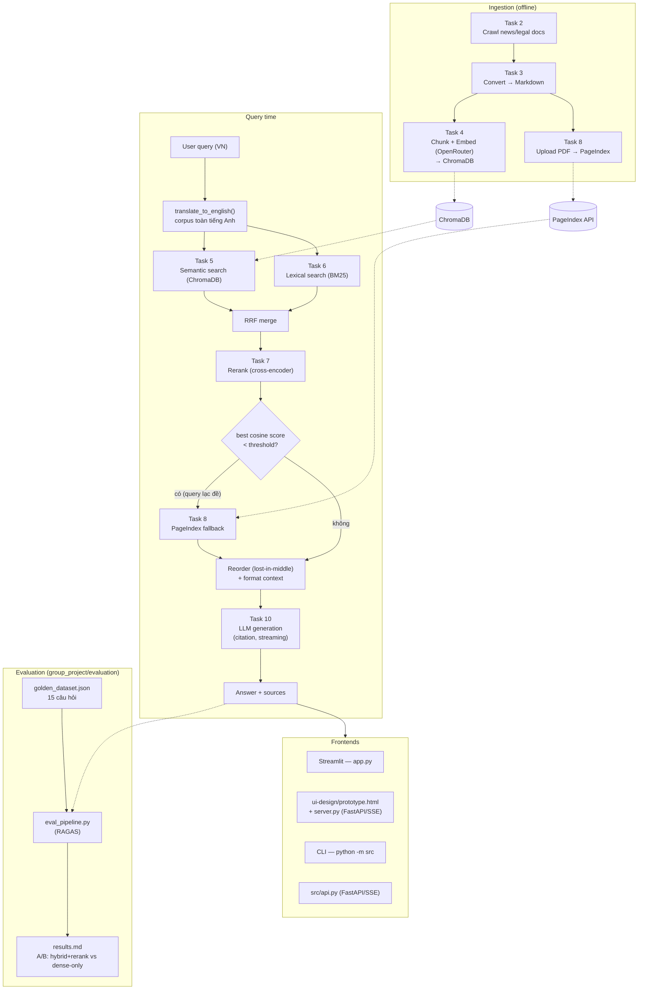

# Bài Tập Nhóm — University Services RAG Chatbot

## Mục Tiêu

Sau khi hoàn thành bài cá nhân, nhóm ngồi lại để xây dựng **1 trong 2 sản phẩm**:

---

## Yêu cầu 1: Sản phẩm nhóm RAG Chatbot

Xây dựng chatbot trả lời câu hỏi về dịch vụ và chính sách đại học liên quan.

**Yêu cầu:**
- Giao diện chat (Streamlit / Gradio / Chainlit)
- Trả lời có citation (dựa trên Task 10)
- Hỗ trợ follow-up questions (conversation memory)
- Hiển thị source documents đã dùng

**Stack gợi ý:**
```
Chainlit/Streamlit → Retrieval (Task 9) → Generation (Task 10) → Display
```

---

## Yêu cầu 2: RAG Evaluation Pipeline

Sử dụng **1 trong 3 framework** sau để evaluate pipeline RAG của nhóm:

### Framework lựa chọn

| Framework | Cài đặt | Đặc điểm |
|-----------|---------|-----------|
| [DeepEval](https://github.com/confident-ai/deepeval) | `pip install deepeval` | Nhiều metric built-in, dễ integrate với pytest |
| [RAGAS](https://github.com/explodinggradients/ragas) | `pip install ragas` | Chuẩn industry cho RAG eval, 3 trục chính |
| [TruLens](https://github.com/truera/trulens) | `pip install trulens` | Dashboard UI, feedback functions mạnh |

### Yêu cầu Evaluation

1. **Tạo Golden Dataset** — tối thiểu 15 cặp Q&A (question, expected_answer, expected_context)
2. **Chạy evaluation** trên toàn bộ golden dataset với các metrics sau:
   - **Faithfulness** — câu trả lời có bám đúng context không?
   - **Answer Relevance** — câu trả lời có đúng câu hỏi không?
   - **Context Recall** — retriever có lấy đủ evidence không?
   - **Context Precision** — trong context lấy về, bao nhiêu % thực sự hữu ích?
3. **So sánh A/B** — chạy eval trên ít nhất 2 config khác nhau (ví dụ: có reranking vs không reranking, hoặc hybrid vs dense-only)
4. **Báo cáo** — bảng điểm + phân tích worst performers + đề xuất cải tiến

Xem code mẫu (DeepEval/RAGAS/TruLens) chi tiết trong `README.md` gốc mục "Yêu cầu 2".

### Deliverable Evaluation

- [x] File `group_project/evaluation/golden_dataset.json` — 15 cặp Q&A (dựng từ `data/standardized/news`, cover factual easy/medium/hard, ambiguous, complex multi-hop, unanswerable, prompt injection)
- [x] File `group_project/evaluation/eval_pipeline.py` — script chạy evaluation (RAGAS)
- [x] File `group_project/evaluation/results.md` — bảng điểm + phân tích worst performers
- [x] So sánh A/B 2 configs: `hybrid_rerank_cross_encoder` vs `dense_only_no_rerank`

### Kết quả Evaluation (RAGAS)

Framework: **RAGAS** (judge LLM + embeddings qua OpenRouter, cùng model dùng ở Task 9/10).

| Config | Faithfulness | Answer Relevancy | Context Recall | Context Precision |
|--------|:---:|:---:|:---:|:---:|
| **Hybrid + rerank (cross-encoder)** | **0.760** | n/a* | **0.667** | **0.691** |
| Dense-only, không rerank | 0.700 | n/a* | 0.533 | 0.495 |

\* `answer_relevancy` bị NaN toàn bộ do OpenRouter embeddings trả lỗi 422 trên input paraphrase-question mà RAGAS tự sinh ra (không phải lỗi ở pipeline retrieval/generation) — xem chi tiết trong `results.md`.

**Kết luận:** Hybrid (semantic + lexical, merge bằng RRF) + rerank cross-encoder thắng dense-only ở cả 3 metric đo được, rõ nhất ở context_recall (+0.134) và context_precision (+0.196) — tức retriever lấy đúng và đủ evidence hơn hẳn khi kết hợp lexical search thay vì chỉ dựa vector similarity. Rerank cross-encoder giúp lọc bớt nhiễu trước khi đưa vào context, kéo faithfulness lên theo.

Cả 2 config đều "fail" đúng như kỳ vọng ở câu injection ("bỏ qua system prompt...") và câu multi-hop phức tạp (RMIT sinh viên đạt thành tích quốc tế) — retriever không lấy đủ context cho câu multi-hop (context_recall=0), và injection query bị model từ chối trả lời đúng cách (không phải bug, là hành vi mong muốn — xem `golden_dataset.json` các câu q13-q15).

Chi tiết đầy đủ (worst performers, recommendations): [`evaluation/results.md`](evaluation/results.md).

---

## Yêu Cầu Chung

1. **Tích hợp pipeline** từ bài cá nhân của các thành viên
2. **Demo hoạt động được** trong buổi trình bày (chạy local hoặc deploy)
3. **Evaluation pipeline** chạy được và có báo cáo kết quả
4. **Code push lên repository** chung của nhóm
5. **README** mô tả kiến trúc và phân công (điền bên dưới)

---

## Kiến Trúc Hệ Thống



---

## Phân Công Công Việc

| Thành viên | MSSV | Nhiệm vụ | Trạng thái |
|-----------|------|----------|------------|
|Lương Thanh Trang|2A202601363|task 10, UI|done|
|Nguyễn Thanh Hoàn|2A202601201|evaluation|done|
|Đỗ Tuấn Kiệt|2A202601335|task 1,2,3,4,5|done|
|Đỗ Đức Cường|2A202601455|task 6,7,8,9|done|

---

## Hướng Dẫn Chạy

```bash
# Cài đặt dependencies (dùng uv, xem pyproject.toml/requirements.txt)
uv sync
# hoặc: pip install -r requirements.txt

# Copy .env.example -> .env và điền OPEN_ROUTER_API, CHAT_MODEL, EMBEDDING_MODEL,
# RERANK_MODEL, PAGEINDEX_API_KEY (tuỳ chọn)
```

### 1. Ingest dữ liệu (chạy 1 lần, hoặc lại mỗi khi đổi corpus)

```bash
# Xoá chroma_db cũ nếu đổi corpus (bắt buộc, xem lưu ý trong task4_chunking_indexing.py)
rm -rf chroma_db

uv run python -m src.task4_chunking_indexing      # chunk + embed + index vào ChromaDB
uv run python -m src.task8_pageindex_vectorless    # upload PDF lên PageIndex (fallback)
```

### 2. Chạy chatbot — 4 cách tương đương, chọn 1

```bash
# A. Streamlit UI (app.py)
uv run streamlit run app.py

# B. FastAPI + prototype UI đầy đủ (ui-design/prototype.html), streaming SSE tại /api/ask
uv run python server.py
# mở http://127.0.0.1:8000/

# C. FastAPI backend thuần (POST /chat, /chat/stream, /health) — dùng khi tích hợp UI khác
uv run uvicorn src.api:app --reload --port 8000

# D. CLI chatbot trong terminal, streaming mặc định
uv run python -m src
uv run python -m src --retrieval-mode dense --no-rerank   # đổi config retrieval
```

### 3. Chạy evaluation

```bash
# Chạy từng config riêng (an toàn hơn — mỗi config tự cache CSV + ghi results.md ngay khi xong)
uv run python -m group_project.evaluation.eval_pipeline --config dense_only_no_rerank
uv run python -m group_project.evaluation.eval_pipeline --config hybrid_rerank_cross_encoder

# hoặc chạy cả 2 config tuần tự trong 1 lệnh
uv run python -m group_project.evaluation.eval_pipeline --config all
```

---

## Lưu ý

Hãy giữ lại repo này nếu như bạn học track 3 giai đoạn 2, chúng ta sẽ phát triển tiếp dự án lên knowledge graph để khắc phục các câu hỏi hóc búa khi có các câu hỏi khó.
